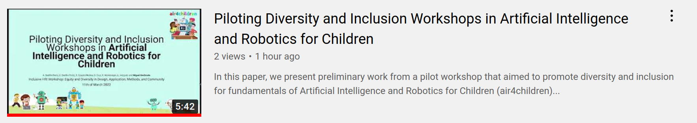

# Slides

Because of limited time, our slides were prepared using google shared documents than LaTeX version.
See [slides-final.pdf](slides-final.pdf)

## YouTube Video
Title:
Piloting Diversity and Inclusion Workshops in Artificial Intelligence and Robotics for Children

Description: 
In this paper, we present preliminary work from a pilot workshop that aimed to promote diversity and inclusion for fundamentals of Artificial Intelligence and Robotics for Children (air4children) in the context of developing countries.
Considering the scarcity of funding and the little to none availability of specialised professionals to teach AI and robotics in developing countries, we present resources based on free open-source hardware and software, open educational resources, and alternative education programs.
That said, the contribution of this work is the pilot workshop of four lessons that promote diversity and inclusion on teaching AI and Robotics for children to a small gender-balanced sample of 14 children of an average age of 7.64 years old.
We conclude that participant, instructors, coordinators and parents engaged well in the pilot workshop noting the various challenges of having the right resources for the workshops in developing countries and posing future work.
The resources to reproduce this work are available at https://github.com/air4children/hri2022

See more about "Diversity, Equity, and Inclusion (DEI) in HRI": https://sites.google.com/view/dei-hri-2022/home

Get in touch
Twitter: https://twitter.com/air4children
GitHub: https://github.com/air4children
Email: air4children@gmail.com

## Settings
* No, it's not 'Made for Kids'
* Comments: Hold all comments for review!

## Video
https://youtu.be/4pd8KsbUDgA  
